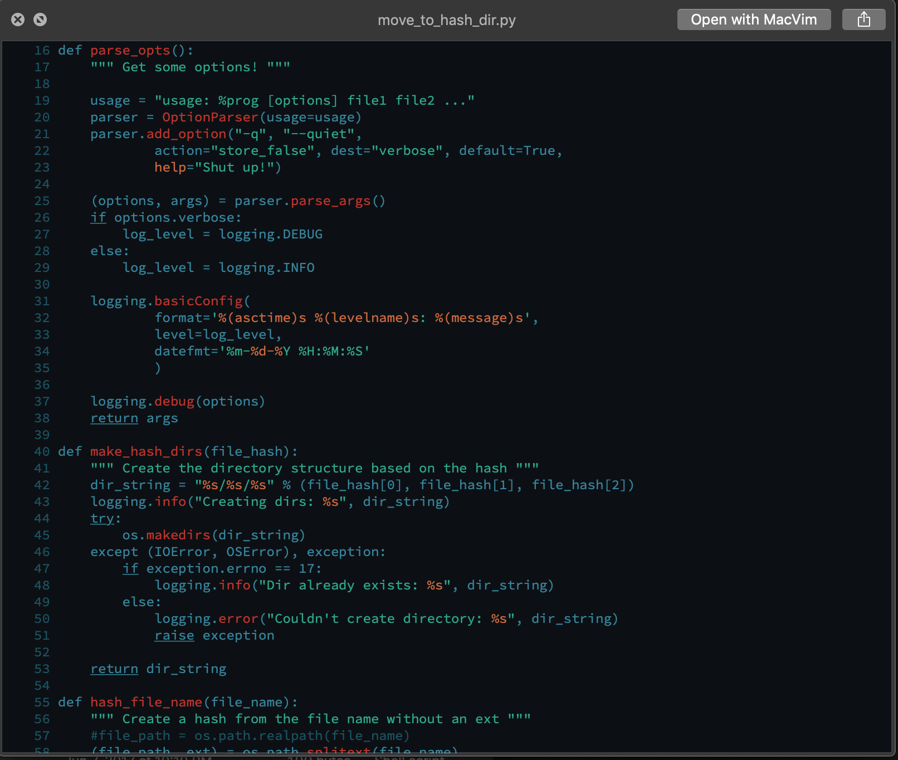

# Gotham for Highlight 
A Gotham inspired theme for the syntax highlighting tool [highlight](https://gitlab.com/saalen/highlight) by Andre Simon

## Installation
The `gotham.theme` file can be installed to `~/.hightlight/themes` or to your system highlight installation such as `/usr/share/highlight/themes/`

## Known Issues
Highlights/Keywords do not always match the vim theme. This requires additional configuration of the underlying `highlight` tool

## TODO
* 16-color theme utilizing [base16-shell](https://github.com/chriskempson/base16-shell/)

## Credits
* [highlight](http://www.andre-simon.de/doku/highlight/) Highlight
* [vim-gotham](https://github.com/whatyouhide/vim-gotham) Color scheme
* [base16-shell](https://github.com/chriskempson/base16-shell/) Shell color setup scripts

