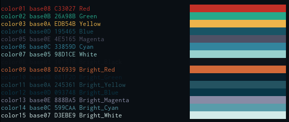

# Gotham Shell
* For who prefer to use a script instead of a terminal emulator theme to color your shell

## Installation
    curl --create-dirs -o $HOME/.config/gotham/gotham.sh https://github.com/whatyouhide/gotham-contrib/raw/master/shell/gotham.sh

### Bash/ZSH
In `~/.bashrc` or `~/.zshrc` place the following lines:

    # Gotham Shell
    GOTHAM_SHELL="$HOME/.config/gotham/gotham.sh"
    [[ -s $GOTHAM_SHELL ]] && source $GOTHAM_SHELL

### Fish
In `config.fish` place the following lines:

    # Gotham Shell
    eval sh $HOME/.config/gotham/gotham.sh

## Color test
Run the **colortest** script to check the color pallet

    curl -o /tmp/colortest https://github.com/whatyouhide/gotham-contrib/raw/master/shell/colortest || /tmp/colortest ~/.config/gotham/gotham.sh

## Known Issues
> I apply the color scheme but the background did not change (e.g. xfce4-terminal).

Background needs to be changed manually on some terminals to `#0a0f14`

> [zsh-autosuggestions](https://github.com/tarruda/zsh-autosuggestions) highlight color is too dark

Override default highlight color on your zshrc to `AUTOSUGGESTION_HIGHLIGHT_COLOR='fg=11'`
or other color of your preference (see [colortest](#color-test)), pick the last two digit of `colorXX`

## TODO
* 256 colorspace

## Credits
[vim-gotham](https://github.com/whatyouhide/vim-gotham) Color scheme
[base16-shell](https://github.com/chriskempson/base16-shell/) Shell color setup scripts

